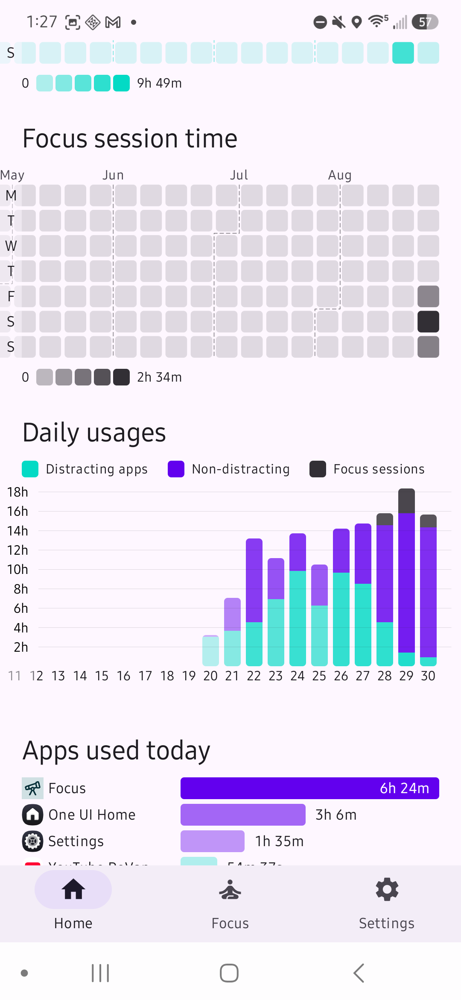
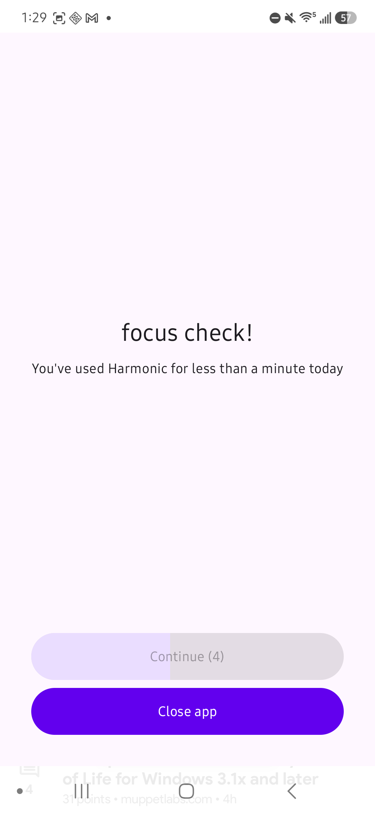
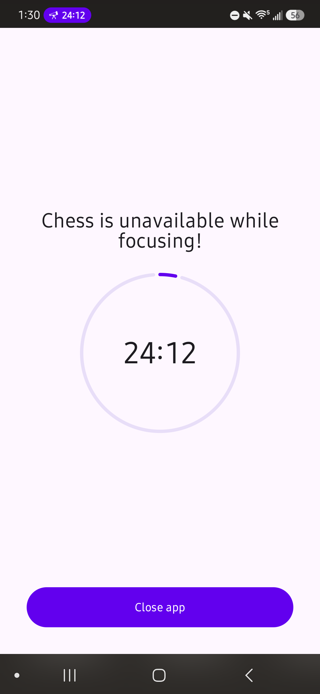
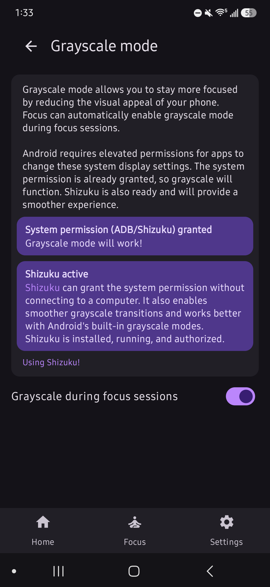
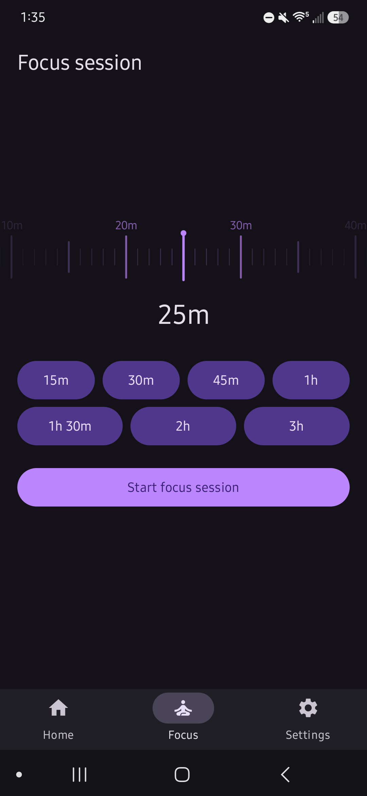
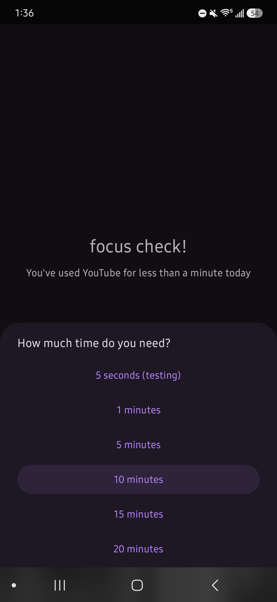

# First focus
*An app to help you keep your first focus in sight*

First focus is a small work-in-progress minimal, local-only screen time and focus management tool for Android. Made by a real human with care :)

<!-- the mystery of app1.png -->



<br />





Features:
- Very minimal UI focused on usability
- Select distracting apps that will be used for time tracking, cooldowns, and focus sessions
- App usage prompt with a configurable countdown to open
- When opening apps, ask for a desired usage time (0-30m) and prompt a reminder when the time is up
- Focus sessions preventing selected apps from being opened for a set duration through an accessibility service
  - Optional grayscale screen during focus sessions (requires `WRITE_SECURE_SETTINGS` granted through ADB or Shizuku)
  - Reminders to start focus sessions at configurable times of day
- Time (app and focus) tracking in a local database with graphs and statistics
- Android 16 live update status bar notifications for focus sessions and app timers
- Export and import of app data and settings to an archive

## architecture
This is my first polished/"real" Android app, so I don't fully know what I'm doing. The app is written in Kotlin and uses Jetpack Compose for the UI and [Room](https://developer.android.com/training/data-storage/room) (a sqlite wrapper) for local data storage.  
Most focus- and blocking-related work occurs in an accessibility service or alarm receivers.

## build
Requirements: Android Studio Android SDK with API 35, Java 17, and [just](https://github.com/casey/just).

```text
just debug # build a debug APK
just install # build and install on a connected device
just release # build a release APK
just test # run JVM tests
just clean # remove build outputs
just check # run static analysis and linting
```

The debug APK is written to `app/build/outputs/apk/debug/app-debug.apk`.

## roadmap / todo
(roughly ordered from easiest to hardest)

- [ ] Improve chart ux
  - [ ] Fallback displays for home screen charts with no data
  - [ ] Better dark theme colors
- [ ] Permission to turn off battery optimization
- [ ] Allow setting theme color
- [ ] Change toasts to snackbars (android is so silly)
- [ ] Clean up repeated top bar/scrollable page structures with a component

- [ ] Better branding
  - [ ] Real custom icon that isnt a placeholder
  - [ ] Adaptive icon (monochrome)
- [ ] Home screen focus session indicator
- [ ] Focus session early stop confirm with a countdown
- [ ] Previous focus session list
- [ ] Active allowances list
- [ ] Setting to always enable Grayscale in distracting apps
- [ ] Sub-pages with additional data when clicking on home screen charts

- [ ] More focus session blocking options, like app whitelist instead of always using distracting apps
- [ ] Focus screen customization
- [ ] Store open focus screens and preventions, maybe in an event log
- [ ] Choose a target daily usage across all distracting apps and prompt reminder when the target is reached
- [ ] Pomodoro for focus sessions
- [ ] Welcome sequence
- [ ] Mindful check with making user type something?

- [ ] Some kind of very light gamification of time tracking, like a bonsai tree or something
- [ ] Maybe, just maybe, collaborative tracking for families/friends/whoever to compete